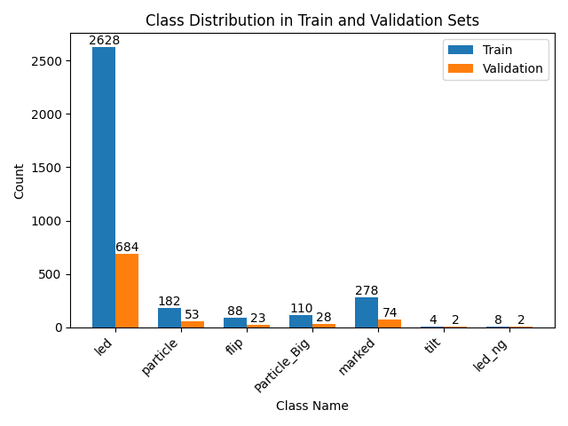

# LED Defects Detection

This repository contains scripts to prepare datasets and train YOLO models for detecting defects in LEDs. The dataset preparation is tailored for YOLO family training, and training/testing is performed using the YOLO framework.

## Setup

1. Clone the repository:
   ```bash
   git clone https://github.com/agbld/led-defects-detection.git
   cd led-defects-detection
   ```

2. Install dependencies:
   ```bash
   pip install -r requirements.txt
   ```

## Dataset Preparation

Use `prepare_dataset.py` to prepare a dataset in YOLO format from a COCO JSON file.

### Example Usage

* Prepare a dataset for all classes:
  ```bash
  python prepare_dataset.py --coco_json ./data/annotations/instance.json --images_dir ./data/images --yolo_dir ./yolo_dataset --train_ratio 0.8
  ```

* Prepare a dataset for specific classes:
  ```bash
  python prepare_dataset.py --coco_json ./data/annotations/instance.json --images_dir ./data/images --yolo_dir ./yolo_dataset --train_ratio 0.8 --included_classes led particle flip Particle_Big marked
  ```

Arguments:
- `--coco_json`: Path to COCO format JSON.
- `--images_dir`: Directory containing images.
- `--yolo_dir`: Directory to save YOLO formatted dataset.
- `--train_ratio`: Ratio for train-validation split (default: 0.8).
- `--included_classes`: Classes to include (default: `['led', 'particle', 'flip', ...]`).

## Model Training and Evaluation

Use `main.py` to train and evaluate the YOLO model.

### Example Usage
```bash
python main.py --data_config ./yolo_dataset/data.yaml --model yolo11x --epochs 50 --batch_size 16 --run_name experiment1
```

Arguments:
- `--data_config`: Path to the dataset config YAML.
- `--model`: YOLO model type (default: `yolo11x`).
- `--epochs`: Number of training epochs (default: 50).
- `--batch_size`: Training batch size (default: 16).
- `--run_name`: Custom run name.

## Experiments

This section contains the results of the experiments conducted during the development of this project. GitHub commits are provided for each experiment to ensure reproducibility.

### Class Sweep

**GitHub Commit**: [0c2a8258e75c5473fdf7dfb1750ccf6a6316fa7e](https://github.com/agbld/led-defects-detection/commit/0c2a8258e75c5473fdf7dfb1750ccf6a6316fa7e)

**Objective**:
- An ablation study or an EDA to observe each class training outcomes.

**Results**:
- Labels distribution <br>
  

- Label "information" <br>
  `led` and `marked` classes have the most samples. However, consider the "information" we get from annotations, `led` and `marked` classes, especially the `marked` class has almost no information. From the following figures, we can see the shape and position of it almost never changes. Things are similar for the `led` class.
  <div style="display: flex; justify-content: space-around;">
    
    
  </div>

- Label "information" (continued) <br>
  On the other hand, `particle`, `Particle_Big` and `flip` have MUCH more "information". See following figures:
  <div style="display: flex; justify-content: space-around;">
    
    
    
  </div>

- Insufficient data <br>
  For the last two classes, `tilt` and `led_ng`, we have very few samples (< 10). This also leads to the stability problem during training. See the following figures:
  

- **Conclusion** <br>
  - `led` and `marked` classes have almost no information. Consider removing them.
  - `particle`, `Particle_Big` and `flip` classes have much more information.
  - `tilt` and `led_ng` classes have insufficient data. Consider getting more samples or removing them.

**Method**:
- Train the model with each class separately. Specifically, use `prepare_dataset.py` to prepare a dataset for each class. Then, train the model with `main.py` for each class.
- Use `yolo11x` model for all experiments.
- Use `--epochs 100` for faster experiments. 

### Training as Validation

**GitHub Commit**: N/A

**Objective**:
- Use the training set as the validation set to see is there any unreasonable labelings that model couldn't even overfit.

**Results**:
- Confusion matrix <br>
  <div style="display: flex; justify-content: space-around;">
    
    
  </div>
- Most of the classes seem to be learned well.

### Model Sweep

**GitHub Commit**: [3fd972925ad585b568fb641629f41f9b4e2537e9](https://github.com/agbld/led-defects-detection/commit/3fd972925ad585b568fb641629f41f9b4e2537e9)

**Objective**:
- Find the best model for current dataset.

**Results**:
- Performance table:
  
- According to precision, recall, mAPs, all tested models have **similar performance**.
- Later models (*yolov9e*, *yolov10x*, *yolo11x*) have very slightly better performance than older models (*yolov5xu*, *yolov8x*).

**Method**:
- Use only those "major" classes that have enough samples to eliminate the data insufficiency problem. Which are: `led`, `particle`, `flip`, `Particle_Big`, `marked`.
- Tested models:
  - `yolov5xu (97.2M)`
  - `yolov8x (68.2M)`
  - `yolov9e (58.1M)`
  - `yolov10x (29.5M)`
  - `yolo11x (56.9M)`